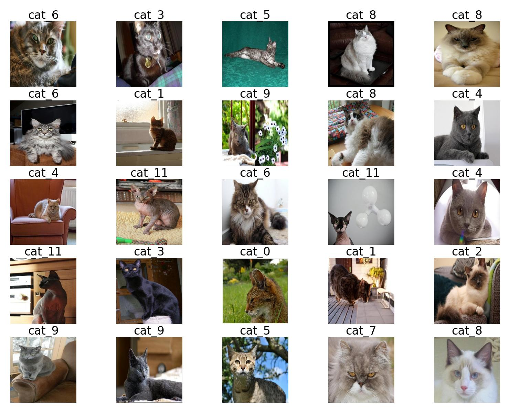
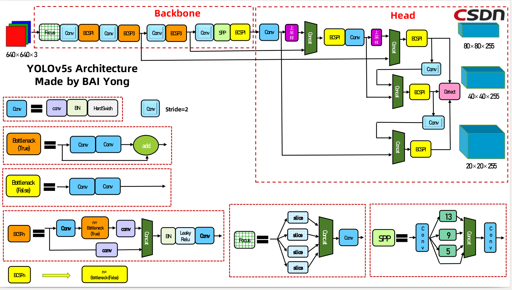
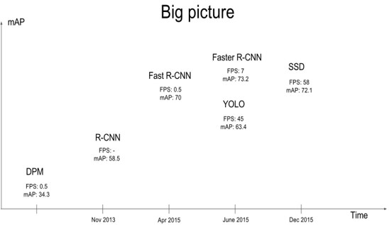
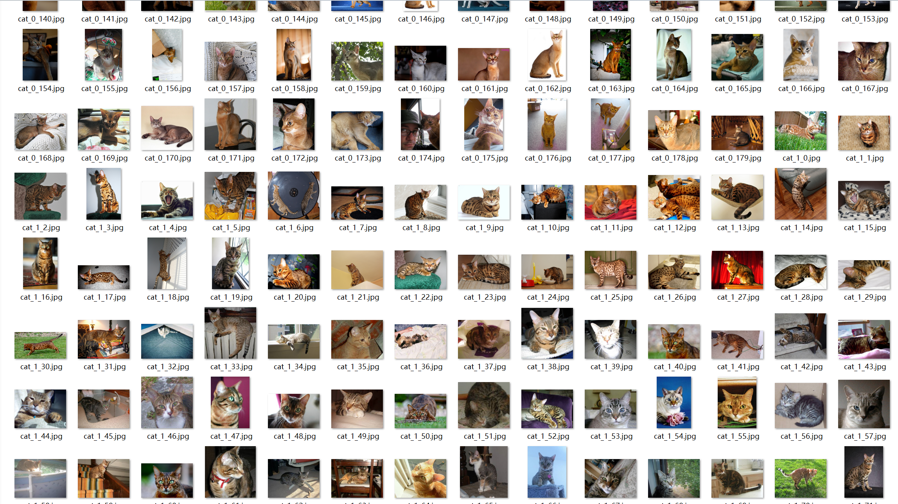
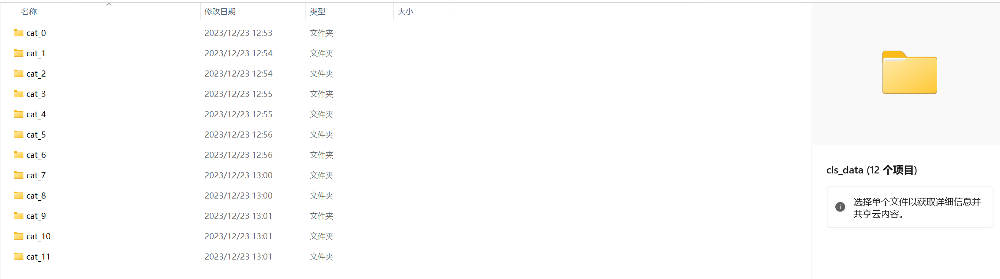
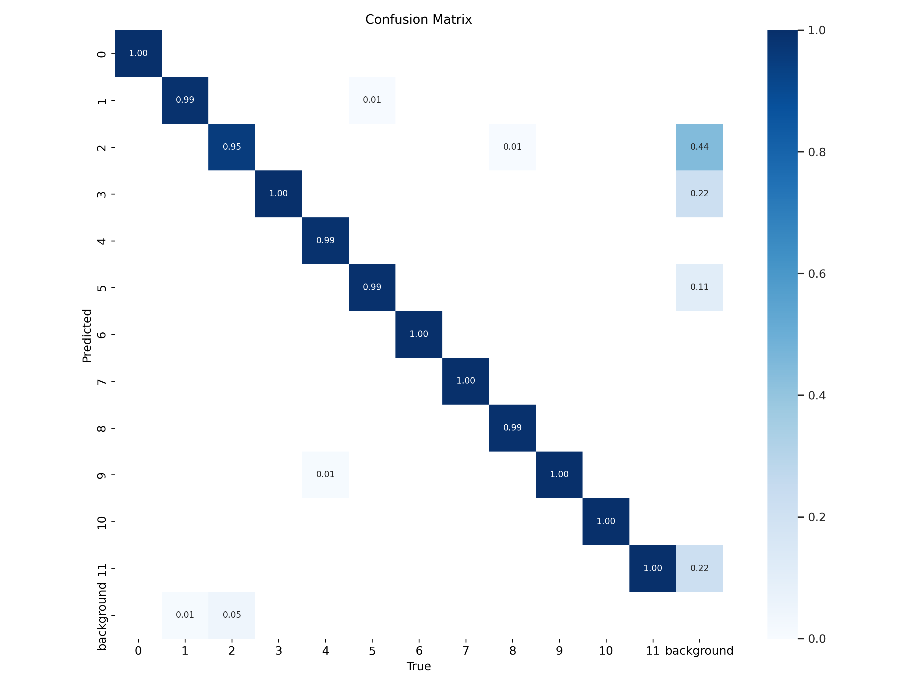
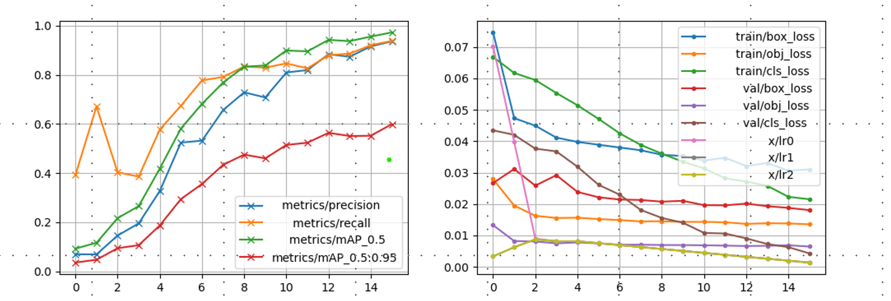
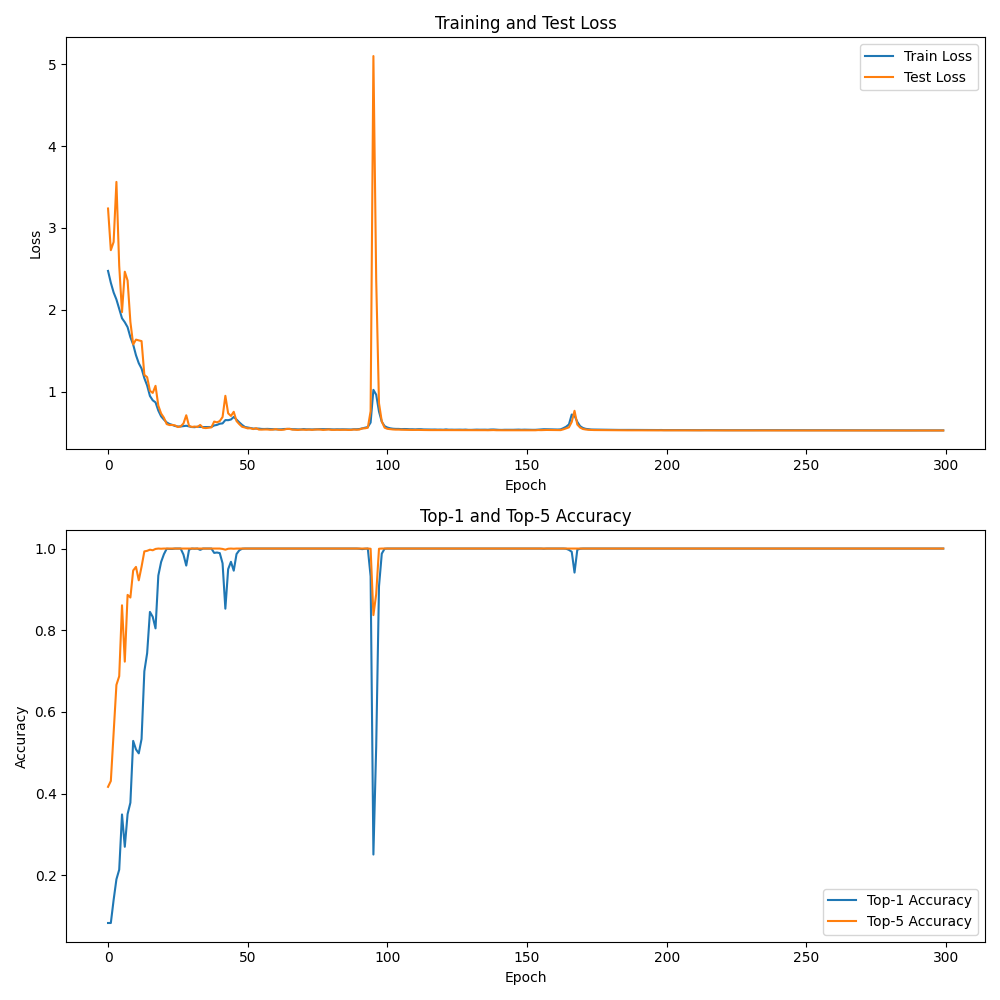
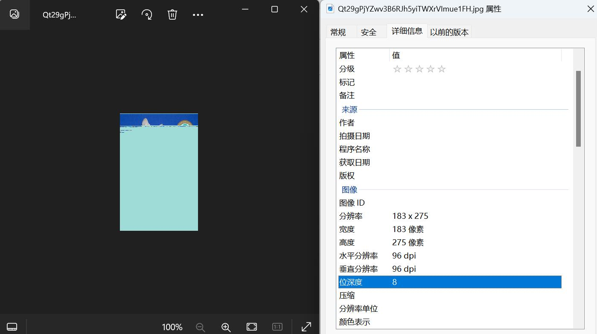

# Classification-On-12Cat-YoloV5(待更新)

#### 被骂了一通后补充:YOLO适合的是目标检测而不是分类。
# 一、项目介绍
## 1.1 项目背景
本项目来自于百度飞桨AI官方比赛:[飞桨学习赛：猫十二分类体验赛](https://aistudio.baidu.com/competition/detail/136/0/introduction)。

本场比赛要求参赛选手对十二种猫进行分类，属于CV方向经典的图像分类任务。图像分类任务作为其他图像任务的基石，可以让大家更快上手计算机视觉。

## 1.2 项目原理
众所周知，YOLOv5是一款优秀的目标检测模型，但实际上，它也支持图像分类。在6.1版本中，就暗留了classify这个参数，可以在做检测的同时进行分类。所以我们采用YOLO模型来对这个问题进行处理。

本项目模型代码来自于Yolo-Version代码:[YoloV5 in pytorch](https://github.com/ultralytics/yolov5)。

## 1.3 参考项目
本项目灵感来源于[ResNet and ViT 在 12 Cat Classification 上的表现](https://github.com/CPones/Classification-12Cat-ResNet-and-ViT)。
# 二、数据集

本数据集大部分可以用Code中的python代码来实现对官方数据集的操作。
|                                                             名称                                                              | 训练集和验证集 | 测试集 |   图像尺寸   |
| :---------------------------------------------------------------------------------------------------------------------------: | :------------: | :----: | :----------: |
|                      [cat_12_train(官方数据集)](https://aistudio.baidu.com/aistudio/datasetDetail/10954)                      |      2160      |  240   | 任意尺寸都有 |
|        [cat_12_train_resort](https://github.com/Gthelurd/Classification-On-12Cat-YoloV5/tree/main/cat_12_train_resort)        |      2159      |   -    | 任意尺寸都有 |
| [cat_12_train_result_resize](https://github.com/Gthelurd/Classification-On-12Cat-YoloV5/tree/main/cat_12_train_result_resize) |      2159      |   -    |  [640,640]   |
|                   [datasets](https://github.com/Gthelurd/Classification-On-12Cat-YoloV5/tree/main/datasets)                   |      2159      |   -    |  [224, 224]  |
|                [cat_12_test](https://github.com/Gthelurd/Classification-On-12Cat-YoloV5/tree/main/cat_12_test)                |       -        |  240   | 任意尺寸都有 |

官方数据集提供了train_list.txt，其中标注了cat_12_train中的图片类别用于训练。
```
#官方数据集目录结构
dataset/
|—— cat_12_train
│   |——  0aSixIFj9X73z41LMDUQ6ZykwnBA5YJW.jpg
│   |——  0bBWRPd2t4NDIaO8567oyTgK3MU9rJZS.jpg
│   |   ...
|—— cat_12_test
│   |——  mXIfNyVxBOZin4KQlYMdkPTSFA85ugrH.jpg
│   |——  zXyot03giwfhecLJlCm5NjQnY6VHq7Da.jpg
│   |   ...
|——train_list.txt
```
本数据集datasets是用于YOLO_cls的数据集形式，请注意需要给出(train/test/val)三个文件夹。

```
#datasets数据集目录结构
datasets/
|—— cat_0
|   |—— cat_0_0.jpg
|   |—— cat_0_1.jpg
|   |—— ...
|—— cat_1
|   |—— cat_1_0.jpg
|   |—— cat_1_1.jpg
|   |—— ...
|——...
|——...
|——cat_11
|   |—— cat_11_0.jpg
|   |—— cat_11_1.jpg
|   |—— ...
```
[data_txt](https://github.com/Gthelurd/Classification-On-12Cat-YoloV5/tree/main/data_txt)与[data_json](https://github.com/Gthelurd/Classification-On-12Cat-YoloV5/tree/main/data_json)都是对于cat_{class}_{index}.jpg的bbox标注(xywh)格式。

# 三、模型设计
## 3.1 YOLO模型
#### 3.1.1 网络结构
我们选择的[YoloV5网络结构](https://blog.csdn.net/nan355655600/article/details/107852288)如下图所示:

YOLO模型部分绕过卷积网络，可以提高识别准确率。
#### 3.1.2 不同网络对比
不难看出，YOLO算法仍然具有一定的优越性。

## 3.2 Code讲解
Code下放置的都是.py文件，请注意路径的准确性。
#### 3.2.1 [labels.py]()
这段代码的作用主要是将labelme的.json格式转换为YOLO的.txt格式。
这里的.json格式与.txt格式都是bbox(xywh)的格式。

```
# 参考链接:https://blog.csdn.net/flyfish1986/article/details/117133648
# bbox_format主要是[x_center,y_center,width,height] (归一化后)
# x_center, y_center表示边框的中心位置， width, height分别表示边框的宽度和高度
# 比如此图:边框的宽度是322,高度是117
# 不规范化是 
# [(98 + (322 / 2)), (345 + (117 / 2)), 322, 117]=[259, 403.5, 322, 117]
# 规范化方法是
# [259 / 640, 403.5 / 480, 322 / 640, 117 / 480]
# 最终结果是
# [0.4046875, 0.840625, 0.503125, 0.24375].
    核心算法表示:
            x_center = (x1 + x2) / 2 / imageWidth
            y_center = (y1 + y2) / 2 / imageHeight
            bbox_w = abs(x2 - x1) / imageWidth
            bbox_h = abs(y2 - y1) / imageHeight
```
#### 3.2.2 [reclass.py]()
主要是labelme的文件在其他格式下容易报错。
这段代码的主要作用就是转换为RGB格式。
```
# 参考链接：https://www.jianshu.com/p/e8d058767dfa
# 而labelme只认识RGB格式，不然会报:
# OSError: cannot write mode P as JPEG
# OSError: cannot write mode RGBA as JPEG
# 模式
# 1             1位像素，黑和白，存成8位的像素
# L             8位像素，黑白
# P             8位像素，使用调色板映射到任何其他模式
# RGB           3×8位像素，真彩
# RGBA          4×8位像素，真彩+透明通道
# CMYK          4×8位像素，颜色隔离
# YCbCr         3×8位像素，彩色视频格式
# I             32位整型像素
# F             32位浮点型像素
```
#### 3.2.3 [resize.py]()
这段代码主要是重构imgsize到[new_width,new_height]。
yolov5中必须将 img_size 设置为 32 的整数倍，也即new_width=new_height=224   (or 640)。
但是yolo自带源码中的utils/dataset.py中的load_image方法，是将图片的长边缩放到这个img_size大小,而短边是等比例缩放的，也就是会不超过img_size。
```
# 参考链接:https://blog.csdn.net/sp7414/article/details/116781653
def resize(new_width, new_height, path, save_path):
    for i in glob.glob(path):
        im1 = cv2.imread(i)
        # print(im1)
        print(im1.shape,i)
        im2 = cv2.resize(im1, (new_width,new_height))
        cv2.imwrite(os.path.join(save_path, os.path.basename(i)), im2)
```
#### 3.2.4 [sort.py]()
这段代码主要是将train_list.txt与cat_12_train中的图片对应起来并重新划分为cat_{kind}_{index}格式:


#### 3.2.5 [spiltclass.py]()
这段代码是将cat_{kind}_{index}按照{kind}不同种类划分成cls-dataset的形式。


# 四、项目启动
## 4.1 解压数据集
#### 4.1.1 YOLO即时检测训练配置
请将数据集放置在datasets下，并且配置相应的data.yaml如下:
```
# train and val data as 1) directory: path/images/, 2) file: path/images.txt, or 3) list: [path1/images/, path2/images/]
path: ../ # dataset root dir
train: images/ # same to ../images
val: images/ # same to ../images
test: cat_12_test/
# number of classes
nc: 12
# class names
names: ['0', '1', '2', '3', '4', '5', '6', '7', '8', '9', '10', '11']
```
最终应该有如下的结构图:
```
dataset/
|—— images
│   |——  cat_0_0.jpg
│   |——  cat_0_1.jpg
│   |   ...
|—— labels
│   |——  cat_0_0.txt
│   |——  cat_0_1.txt
│   |   ...
|—— cat_12_test
|   |——  0inVXMEgaBO4Fcrhdj9bkLvHzN71yTuI.jpg
|   |——  ...
|—— data.yaml
```

#### 4.1.2YOLO分类任务训练配置
请将数据集放置在datasets下，有如下结构图:
```
dataset/
|—— train
│   |——  cat_0
|   |    |——  cat_0_0.jpg
|   |    |——  ...
│   |——  cat_1
|   |    |——  cat_1_0.jpg
|   |    |——  ...
│   |   ...
|—— val
│   |——  cat_0
|   |    |——  cat_0_0.jpg
|   |    |——  ...
│   |——  cat_1
|   |    |——  cat_1_0.jpg
|   |    |——  ...
│   |   ...
|—— test
│   |——  cat_0
|   |    |——  cat_0_0.jpg
|   |    |——  ...
│   |——  cat_1
|   |    |——  cat_1_0.jpg
|   |    |——  ...
│   |   ...
```

## 4.2 运行yolov5
#### 4.2.1 即时检测任务
```
python yolov5/train.py --data datasets/data.yaml --imgsz 640 --epoch 30 --weights yolov5s.pt --config yolov5s.yaml
```
#### 4.2.2 目标分类任务
```
python yolov5/classify/train.py --data  datasets --imgsz 224 --epoch 30 --pretrain yolov5s-cls.pt
```
## 4.3 Yolo结果输出
#### 4.2.1 即时检测任务
```
python yolov5/detect.py --source datasets/cat_12_test --weights yolov5/runs/train/exp1/best.pt
```
#### 4.2.2 目标分类任务
```
python yolov5/classify/predict.py --source datasets/cat_12_test --weights yolov5/runs/train-cls/exp1/best.pt
```
# 五、结果评估
## 5.1 即时检测结果
#### 5.1.1 混淆矩阵
在机器学习领域和统计分类问题中，混淆矩阵（英语：confusion matrix）是可视化工具，特别用于监督学习，在无监督学习一般叫做匹配矩阵。矩阵的每一列代表一个类的实例预测，而每一行表示一个实际的类的实例。

可以看出0,3,6,7,9,10,11类别理论上不会识别错误，几乎趋近于1。
#### 5.1.2 result.csv(部分)
上升的曲线:
- Precision：精度(找对的正类/所有找到的正类)
- Recall：真实为positive的准确率，即正样本召回了多少
- mAP@0.5:0.95(mAP@[0.5:0.95]):表示在不同IoU阈值(从0.5到0.95，步长0.05)上的平均mAP。
- mAP@0.5：表示阈值大于0.5的平均mAP

下降的曲线:
- 定位损失box_loss：预测框与标定框之间的误差（GIoU）
- 置信度损失obj_loss：计算网络的置信度
- 分类损失cls_loss：计算锚框与对应的标定分类是否正确


基本可以看出结果较为完备(正确率约为90%)，训练模型完成。
|      Model       | map@0.5 | map@[0.5,0.95] | params(M) | GFLOPs |
| :--------------: | :-----: | :------------: | :-------: | :----: |
| [best_base.pt]() | 0.99374 |    0.69769     |   70.52   |  16.0  |

## 5.2 分类任务结果
#### 5.2.1 挺尴尬的过拟合了XDDD
经过长达数个小时的三百次训练之后，得到了这些图:

<!--  -->
初步估计训练30~50次即可，过拟合的模型正确率为：34%。

#### 5.2.2 补充
基本可以看出结果较为完备(正确率约为93%)，训练模型完成。
|      Model      | atop@5  | atop@1  | params(M) | GFLOPs |
| :-------------: | :-----: | :-----: | :-------: | :----: |
| [best_cls.pt]() | 0.99954 | 0.69769 |   63.81   |  10.4  |
# 六、总结
YOLOV5支持的classify任务可以充当分类问题的解决方案，但是检验的效果并不理想，我们需要更进一步地探究如何调整来使预测模型更加准确。同时也可以自己进行进一步的剪枝等操作来获取更加精确的网络结构模型。
现在YOLO的优势在于部署简单，运行较快；但是识别精度不高，同时是闭集识别。所以以后YOLO的进步方向可能有
# 七、数据分析以及参考文献
## 7.1 学习文献
###### [关于batch_size的大小对于训练模型的影响。](https://arxiv.org/abs/1812.06162)
###### [江大白的yolov5相关分析讲解。](https://zhuanlan.zhihu.com/p/172121380)
###### [MMYOLO的yolov5算法原理介绍。](https://mmyolo.readthedocs.io/en/latest/recommended_topics/algorithm_descriptions/yolov5_description.html)
###### [yolov5软剪枝之代码重构](https://zhuanlan.zhihu.com/p/389568469)
###### [yolov5软剪枝之算法讲解](https://zhuanlan.zhihu.com/p/391045703)
## 7.2 数据分析

#### 7.2.1 YOLOV5的分析：
###### 7.2.1.1 损失函数 | BCE Loss（Binary CrossEntropy Loss）
BCE主要适用于二分类的任务，而且多标签分类任务可以简单地理解为多个二元分类任务叠加。所以BCE经过简单修改也可以适用于多标签分类任务。
###### 7.2.1.2 网络结构 |

# 八、相关论文(大概吧)
[UnitBox: An Advanced Object Detection Network](./doc/1608.01471.pdf)这一篇中的IOU损失。
[A COMPREHENSIVE REVIEW OF YOLO ARCHITECTURES IN COMPUTER VISION: FROM YOLOV1 TO YOLOV8 AND YOLO-NAS](./doc/2304.00501.pdf)的YOLO网络结构讲解。 
[细粒度图像分类的深度学习方法](./doc/细粒度图像分类的深度学习方法.pdf)的关于YOLO在细粒度领域的应用。
[YOLOV9](./doc/2402.13616.pdf)(这篇只是凑个数，YOLOV9很新) 
[YOLOv3 和双线性特征融合的细粒度图像分类](./doc/create_pdf.pdf)的YOLO在细粒度分类任务的实际应用。
[Fine-grained Classification of YOLOv5 Remote Sensing Aircraft Targets Incorporating Broad Learning System](./doc/Fine-grained_Classification_of_YOLOv5_Remote_Sensing_Aircraft_Targets_Incorporating_Broad_Learning_System.pdf)的YOLOV5应用于细粒度问题。
[Statistical Analysis of Design Aspects of Various YOLO-Based Deep Learning Models for Object Detection](./doc/s44196-023-00302-w.pdf)的YOLO网络结构。
[Research on Fine-Grained Image Recognition of Birds Based on Improved YOLOv5](./doc/sensors-23-08204-v3.pdf)的YOLOV5的一种改进方法。
# 九、 记录点
## 9.1 图片
部分图片采用位深度不同以及像素大小不同(参考reclass与resize)


```
### 坏道报错
  File "F:\VSC-code\DeepLearning\FinalProj\YOLO_A\yolov5-master\utils\dataloaders.py", line 308, in __next__
    assert im0 is not None, f'Image Not Found {path}'
AssertionError: Image Not Found F:\VSC-code\DeepLearning\Myproj\cat_12_test\Qt29gPjYZwv3B6RJh5yiTWXrVImue1FH.jpg
```
## 9.2 自改网络结构
```
#### 这个添加到models/common.py中
class Multi_Conv(nn.Module):
    # Multi Different Kernel-size Conv
    def __init__(self, c1, c2, e=1.0):
        super().__init__()
        c_ = int(c2 * e)
        self.cv1 = Conv(c1, c_, 3, 2)
        self.cv2 = Conv(c1, c_, 7, 2)

    def forward(self, x):
        return self.cv1(x) + self.cv2(x)


#### 这个添加到models/yolo.py中
if m in {
        Conv, GhostConv, Bottleneck, GhostBottleneck, SPP, SPPF, DWConv, MixConv2d, Focus, CrossConv,
        BottleneckCSP, C3, C3TR, C3SPP, C3Ghost, nn.ConvTranspose2d, DWConvTranspose2d, C3x, Multi_Conv}
```
详细请参考[添加注意力机制](https://blog.csdn.net/Mr_Clutch/article/details/119912926)与[修改自己的网络结构](https://blog.csdn.net/qq1198768105/article/details/130170114)。
