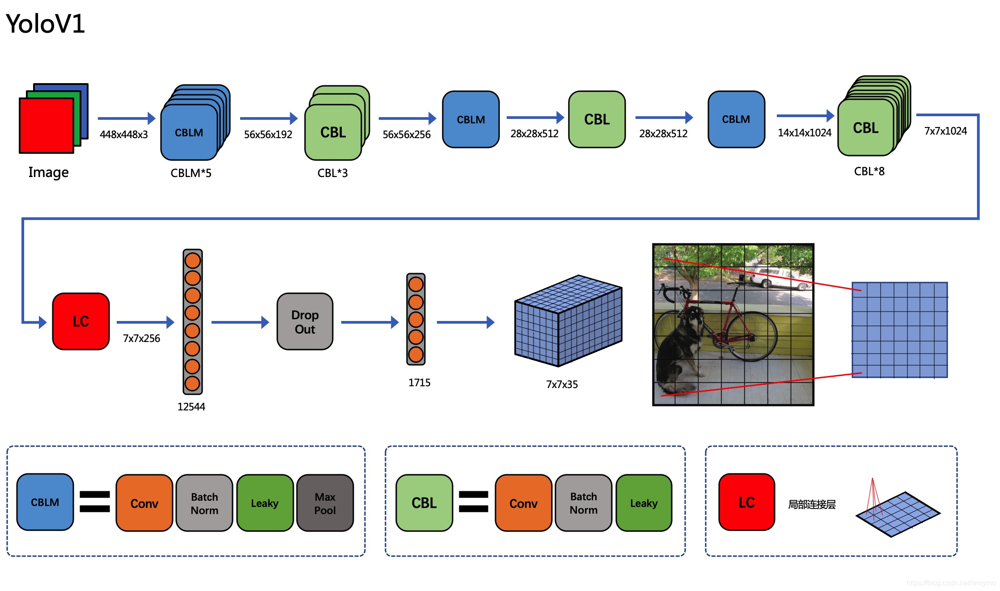

# Classification-On-12Cat-YoloV5
# 一、项目介绍
本项目来自于百度飞桨AI官方比赛:[飞桨学习赛：猫十二分类体验赛](https://aistudio.baidu.com/competition/detail/136/0/introduction)。

本场比赛要求参赛选手对十二种猫进行分类，属于CV方向经典的图像分类任务。图像分类任务作为其他图像任务的基石，可以让大家更快上手计算机视觉。

# 二、数据集
本数据集大部分可以用Code中的python代码来实现对官方数据集的操作。
| 名称 | 训练集和验证集 | 测试集 |  图像尺寸  |
| :--------: | :--------: | :--------: | :--------: |
| [cat_12_train(官方数据集)](https://aistudio.baidu.com/aistudio/datasetDetail/10954)   |  2160     | 240 |  任意尺寸都有  |
| [cat_12_train_resort]()  |  2159  | 240 | 任意尺寸都有 |
| [cat_12_train_result_resize]()  |  2159  | 240 | [224,224] |
| [datasets]()  |  2159  | 240 | [224, 224] |

官方数据集提供了train_list.txt，其中标注了cat_12_train中的图片类别用于训练。
```
#官方数据集目录结构
dataset/
|—— cat_12_train
│   |——  0aSixIFj9X73z41LMDUQ6ZykwnBA5YJW.jpg
│   |——  0bBWRPd2t4NDIaO8567oyTgK3MU9rJZS.jpg
│   |   ...
|—— cat_12_test
│   |——  mXIfNyVxBOZin4KQlYMdkPTSFA85ugrH.jpg
│   |——  zXyot03giwfhecLJlCm5NjQnY6VHq7Da.jpg
│   |   ...
|——train_list.txt
```
本数据集datasets是用于YOLO_cls的数据集形式，请注意需要给出(train/test/val)三个文件夹。
```
#datasets数据集目录结构
datasets/
|—— cat_0
|   |—— cat_0_0.jpg
|   |—— cat_0_1.jpg
|   |—— ...
|—— cat_1
|   |—— cat_1_0.jpg
|   |—— cat_1_1.jpg
|   |—— ...
|——...
|——...
|——cat_11
|   |—— cat_11_0.jpg
|   |—— cat_11_1.jpg
|   |—— ...
```
data_txt与data_json都是对于cat_{class}_{index}.jpg的bbox标注(xywh)格式。

# 三、模型设计
## 3.1 YOLO模型

YOLO模型部分绕过卷积网络，可以提高识别准确率。
## 3.2 Code
Code下放置的都是.py文件，请注意路径的准确性。


